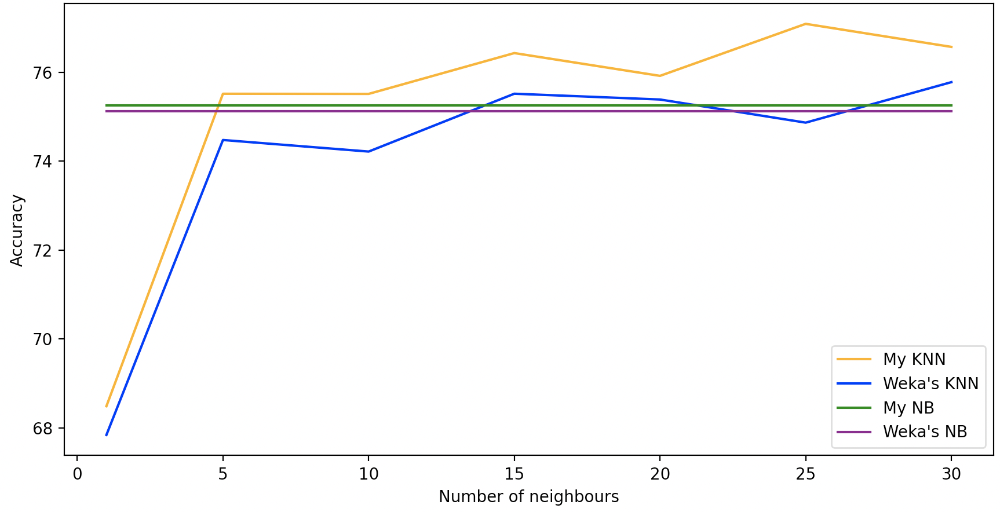

# COMP3308 Assignment2: Report
In this assignment you will implement the K-Nearest Neighbour and Naive Bayes algorithms and evaluate them on a real dataset using the stratified cross validation method. You will also evaluate the performance of other classifiers on the same dataset using Weka. Finally, you will investigate the effect of feature selection, in particular the Correlation-based Feature Selection method (CFS) from Weka.
## Introduction

### Aim of the study
### Importance of the study

## Data

### Description of the dataset
### Attribute selection – brief summary of CFS and a list of the selected attributes

## Results and discussion

Now we will dive deep into the performance of the classifiers. We will first measuer accuracies keeping into consideration all the attributes, and then we will repeat all the analysis with only selected attributes. In both cases we will first analyze results of my KNN, my NB, Weka's KNN and Weka's NB all together, and then analyze results of these classifiers:

- My KNN (with K = 1 and K = 5)
- My NB
- Weka's KNN (with K = 1 and K = 5)
- Weka's NB
- Weka's ZeroR
- Weka's 1R
- Weka's Decision Tree (J48)
- Weka's Multi-Layer Perceptron (MLP)
- Weka's Support Vector Machine (SMO)
- Weka's Random Forest (RF)
Note that all the following tests have been run with 10-fold cross-validation.

### Results with all attributes

#### K-Nearest Neighbours and Naive Bayes

In this section we will explore results of classifiers when working on the full attributes set. In the following plot, results from my KNN, my NB, Weka's KNN and Weka's NB are put together and ready for a deeper discussion:

  

Let's first consider the two K-Nearest Neighbours classifiers:
- My KNN: we can see that the accuracy of the classifier grows with the number of neighbours taken into consideration, then it is quite stable stable once reached K = 15. This classifier has its minimum accuracy of 68.48% for K = 1 and its maximum of 77.09% for K = 25. 
- Weka's KNN: also in this case the accuracy grows with the increasing of the number of neighbours and stabilises after K = 15. The Weka's classifier has its minimum efficiency of 67.83% for K = 1 and it maximum of 75.78% for K = 30.

Overall, for each tested value of K, my classifier is more accurate than Weka's one.  

Regarding the Naive Bayes classifiers:
- My NB: has an accuracy of 75.26%
- Weka's NB: has an accuracy of 75.13%

Also in this case my classifier is more accurate than Weka's one, even if the difference in accuracy is not meaningful. 

From the plot above we can also see that my K-Nearest Neighbour classifier is almost always the best choice for classification in the given domain, only for small K values (K < 5) it is convenient to use Naive Bayes (both mine and Weka's). When comparing the two Naive Bayes classifiers with Weka's KNN, we can see that it is more accurate until K reaches the value of 13, point after which Weka's KNN, Weka's BN and my BN perform almost the same. 

#### All classifiers together

Now we will compare the results given by all the classifiers introduces before, and we will visualize them in the same plot for a better intuitive understanding of the comparison:

#### Performance of my K-Nearest Neighbours classifier

result -> [68.486, 75.52, 75.517, 76.436, 75.923, 77.094, 76.575]

#### Efficiency of Weka's K-Nearest Neighbours classifier

results -> k values = [1, 5, 10, 15, 20, 25, 30] -> [67.8385, 74.4792, 74.2188, 75.5208, 75.3906, 74.8698, 75.7813]

#### Efficiency of myNB

My Naive Bayes classifier has an efficiency of **75.26%**.

#### Efficiency of Weka's NB

result -> 75.1302

#### Comparison between the classifiers (accuracy, other advantages)

Let's now dive deeply into the classifiers comparison. First of all I want to present how 

### Results and results discussion (selected attributes)
 
do the same as previous section but with selected attributes

#### My KNN vs Weka's KNN

You can see how the two classifiers performed during accuracy measurement and comapred on the same plot:

  

As you can see from the figure, my classifiers results to be more accurate than Weka's one for each value of K used.

- Put all what found in result section in the same plot (two plots for K variation and folds variation)

## Conclusions and future work

- Meaningful conclusions based on the results
- Meaningful future work suggested

