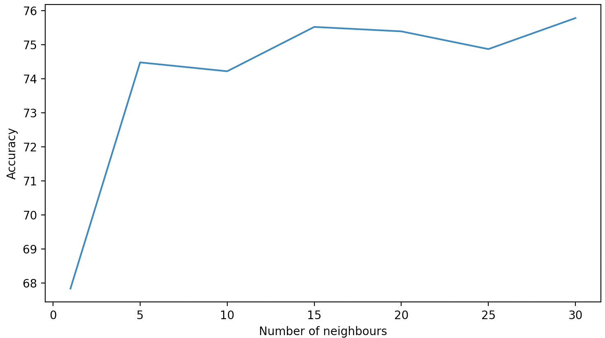
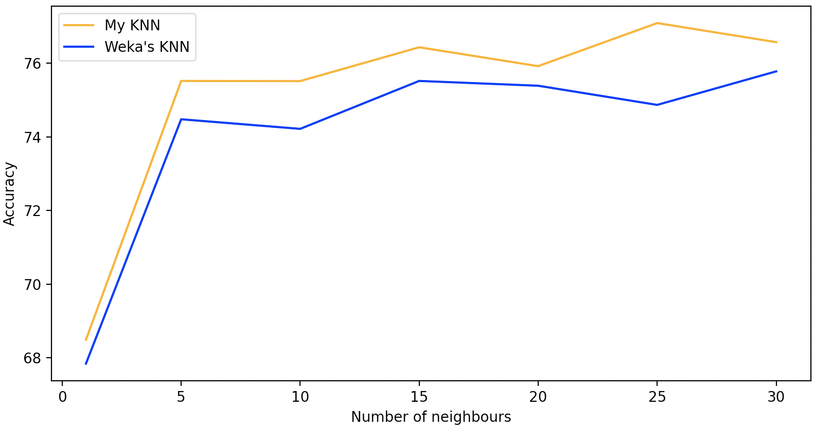

# COMP3308 Assignment2: Report
In this assignment you will implement the K-Nearest Neighbour and Naive Bayes algorithms and evaluate them on a real dataset using the stratified cross validation method. You will also evaluate the performance of other classifiers on the same dataset using Weka. Finally, you will investigate the effect of feature selection, in particular the Correlation-based Feature Selection method (CFS) from Weka.
## Introduction

### Aim of the study
### Importance of the study

## Data

### Description of the dataset
### Attribute selection – brief summary of CFS and a list of the selected attributes

## Results and discussion

Now we will dive deep into the performance of the classifiers. We will first measuer accuracies keeping into consideration all the attributes, and then we will repeat all the analysis with only selected attributes.

### Results and results discussion (all attributes)

The following sections are all about results, and results comparisons with all the attributes taken into consideration. I wanted to keep the frist two sub-sections dedicated to the results of the K-Nearest Neighbours classifier, which will be tested with several K values and then their performances will be plotted. Further in this chapter we will compare KNN and NB classifiers (mine and Weka's) all together, and then compare results of the following classifiers:

- My KNN (with K = 1 and K = 5)
- My NB
- Weka's KNN (with K = 1 and K = 5)
- Weka's NB
- Weka's ZeroR
- Weka's 1R
- Weka's Decision Tree (J48)
- Weka's Multi-Layer Perceptron (MLP)
- Weka's Support Vector Machine (SMO)
- Weka's Random Forest (RF)
Note that all the following tests have been run with 10-fold cross-validation.

#### Performance of my K-Nearest Neighbours classifier

For measuring the classifier performance I decided to run tests both changing the parameter <i>K </i> (i.e. how many nearest neighbours do we take into consideration)
and the number of folds <i> S </i> we want to split the dataset into during the s-fold cross-validation.  

First, let's see how the classifier performs with changes in K parameter. The parameter will change within [0, 30] with steps of 5:

  

We can see how the accuracy generally grows with the number of neighbours taken into consideration, then it is quite stable stable once reached K = 15. This classifier has its minimum accuracy of 68.48% for K = 1 and its maximum of 77.09% for K = 25. 

result -> [68.486, 75.52, 75.517, 76.436, 75.923, 77.094, 76.575]

#### Efficiency of Weka's K-Nearest Neighbours classifier

The test on the Weka's classifier is performed with same K values used for testing mine, and this is how it
performs with changing K:

  

We can see that also in this case the accuracy grows with the increasing of the number of neighbours and stabilises after K = 15. The Weka's classifier has its minimum efficiency of 67.83% for K = 1 and it maximum of 75.78% for K = 30.

results -> k values = [1, 5, 10, 15, 20, 25, 30] -> [67.8385, 74.4792, 74.2188, 75.5208, 75.3906, 74.8698, 75.7813]

#### Efficiency of myNB

My Naive Bayes classifier has an efficiency of **75.26%**.

#### Efficiency of Weka's NB

result -> 75.1302

#### Comparison between the classifiers (accuracy, other advantages)

Let's now dive deeply into the classifiers comparison. First of all I want to present how 

### Results and results discussion (selected attributes)
 
do the same as previous section but with selected attributes

#### My KNN vs Weka's KNN

You can see how the two classifiers performed during accuracy measurement and comapred on the same plot:

  

As you can see from the figure, my classifiers results to be more accurate than Weka's one for each value of K used.

- Put all what found in result section in the same plot (two plots for K variation and folds variation)

## Conclusions and future work

- Meaningful conclusions based on the results
- Meaningful future work suggested

