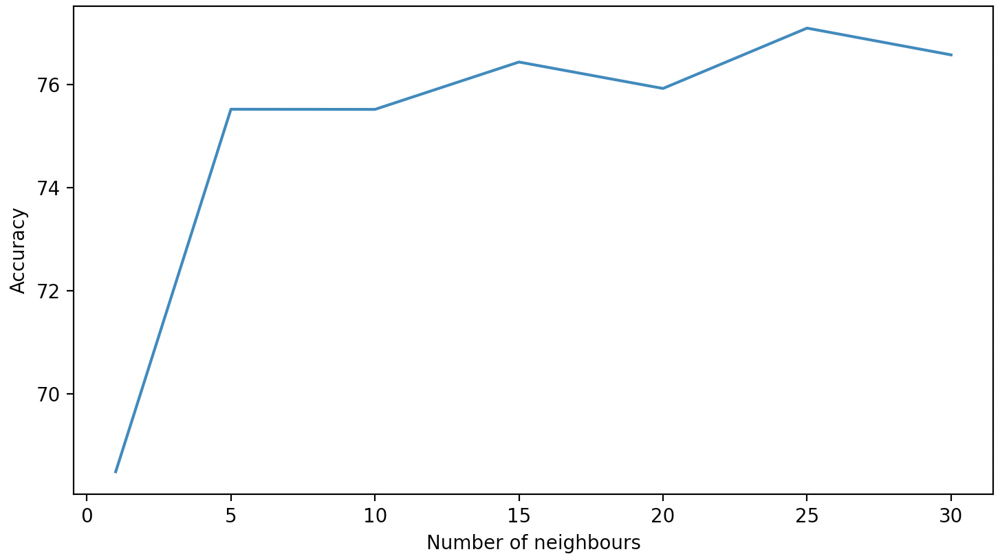

# COMP3308 Assignment2: Report
In this assignment you will implement the K-Nearest Neighbour and Naive Bayes algorithms and evaluate them on a real dataset using the stratified cross validation method. You will also evaluate the performance of other classifiers on the same dataset using Weka. Finally, you will investigate the effect of feature selection, in particular the Correlation-based Feature Selection method (CFS) from Weka.
## Introduction

### Aim of the study
### Importance of the study

## Data

### Description of the dataset
### Attribute selection – brief summary of CFS and a list of the selected attributes

## Results and discussion

### Results and results discussion

The results will be presented in plots, where we will be able to see how the classifiers' accuracy changes with the change of the parameters (number of neighbours for KNN classifier).
Such analysis will be performed both on my classifiers and the ones offered by Weka's software. At the end of the results' presentation,
a comparison between my classifiers and Weka's will be provided.

#### Performance of my K-Nearest Neighbours classifier

For measuring the classifier performance I decided to run tests both changing the parameter <i>K </i> (i.e. how many nearest neighbours do we take into consideration)
and the number of folds <i> S </i> we want to split the dataset into during the s-fold cross-validation.  

First, let's see how the classifier performs with changes in K parameter. The parameter will change within [0, 30] with steps of 5:

  

We can see how the accuracy generally grows with the number of neighbours taken into consideration, then it is quite stable stable once reached K = 15. This classifier has its minimum accuracy of 68.48% for K = 1 and its maximum of 77.09% for K = 25. 

result -> [68.486, 75.52, 75.517, 76.436, 75.923, 77.094, 76.575]

#### Efficiency of Weka's K-Nearest Neighbours classifier

The test on the Weka's classifier is performed with same K values used for testing mine, and this is how it
performs with changing K:

  

We can see that also in this case the accuracy grows with the increasing of the number of neighbours and stabilises after K = 15. The Weka's classifier has its minimum efficiency of 67.83% for K = 1 and it maximum of 75.78% for K = 30.

results -> k values = [1, 5, 10, 15, 20, 25, 30] -> [67.8385, 74.4792, 74.2188, 75.5208, 75.3906, 74.8698, 75.7813]

#### Efficiency of myNB (with different folds)

#### Efficiency of Weka's NB (with different folds, put in the same plot with myNB)

result -> 75.1302

### Effect of the feature selection – beneficial or not (accuracy, other advantages) 
 
do the same as previous section but with selected attributes

### Comparison between the classifiers (accuracy, other advantages)

In this section we will dive deeper in comparisons between different classifiers. The first two sub-sections are dedicated to a more precise comparison between my classifiers and Weka's, while in the further sub-sections other Weka's classifiers will be discussed and compared with my classifiers.

#### My KNN vs Weka's KNN

  

- Put all what found in result section in the same plot (two plots for K variation and folds variation)

## Conclusions and future work

- Meaningful conclusions based on the results
- Meaningful future work suggested

